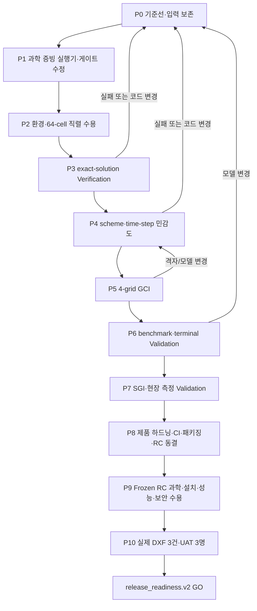

# MEP CFD Studio 과학적 V&V·현장검증·출시 준비 실행계획

**Plan date:** 2026-08-14 · **Current disposition:** NO-GO until the phase gates below pass.

> **For agentic workers:** REQUIRED SUB-SKILL: Use `superpowers:subagent-driven-development` (recommended) or `superpowers:executing-plans` to implement this plan task-by-task. Steps use checkbox (`- [ ]`) syntax for tracking.

**Goal:** MEP CFD Studio를 “계산이 실행되는 프로그램”에서, 적용범위 안에서 수치·물리 신뢰성을 증명하고 기계설비 담당자가 안전하게 사용할 수 있는 직렬 CFD 제품으로 승격한다.

**Architecture:** 검증을 코드/후처리 Verification, 해의 수치 Verification, 물리 Validation, 현장 Validation, 제품/출시 Validation의 다섯 층으로 분리한다. 각 층은 자체 JSON 계약과 SHA-256 증빙을 만들며, 상위 층은 하위 층의 `PASS` 문자열이 아니라 현재 파일과 해시·정량 기준을 다시 계산한다. 최종 릴리스 증빙은 깨끗하게 동결된 하나의 Release Candidate에서만 생성한다.

**Tech Stack:** Windows 11, Python, pytest, WSL2 Ubuntu-24.04, OpenFOAM v2606, FreeCAD 1.1.1/OCC 7.8.1, `buoyantBoussinesqPimpleFoam`, k-ω SST, `blockMesh`/`snappyHexMesh`, JSON Schema, 로컬 웹 GUI.

## Global Constraints

- 최종 지원 실행모드는 우선 **직렬(serial-only)** 로 고정한다. `MPI_RANK_SPAWN_HANG`이 해결되고 별도 동등성 검증을 통과하기 전에는 MPI를 일정·정확성 게이트에 포함하지 않는다.
- `solver exit 0`, `status: PASS`, 화면의 초록색 배지, pytest 통과만으로 물리적 타당성을 선언하지 않는다.
- `SCREENING_ONLY`, `NOT_EVALUATED`, `DESIGN_CITABLE`을 서로 다른 상태로 유지한다. 미완료 증거를 경고만 붙여 승격하지 않는다.
- 실제 설계 인용은 `design_limited_second_order_v1`, 최소 3.0 FTT, 마지막 0.1 FTT 시간창, 실제 solver `phi`, 직접 계산한 `yPlus`, 수치 민감도, GCI, benchmark, 적용범위 증거를 모두 요구한다.
- 모든 장시간 계산은 직렬 solver lock, 입력 지문, 원자적 체크포인트, 재개 이력을 사용한다. 기존 결과나 사용자 도면을 덮어쓰지 않는다.
- 현재 dirty/untracked 파일은 사용자 자산으로 취급한다. `git reset --hard`, `git clean`, 무단 삭제를 금지한다.
- 실제 현장 증빙과 UAT는 RC 동결 후에만 출시 증거로 인정한다. RC가 바뀌면 영향받은 증빙을 무효화하고 다시 수행한다.
- 복사, PMV/PPD, IAQ, age-of-air, MPI 성능은 해당 기능의 별도 Validation이 끝날 때까지 제품 주장 범위에서 제외한다.
- `radiative_fraction>0`인데 복사·표면 열전달이 아직 검증되지 않은 case는 대류 입력만을 분모로 한 에너지 수지를 명시하고 `SCREENING_ONLY`로 제한한다. L3 열성능 인용은 (a) 근거와 함께 `convective_fraction=1.0`, 또는 (b) 검증된 radiation/surface heat-transfer 모델 중 하나가 필요하다.

---

## 1. 완료 수준과 최종 목표

| 수준 | 의미 | 허용되는 표현 | 진입 조건 |
|---|---|---|---|
| L0 코드 회귀 | Python 계약과 오류 차단이 동작 | “코드 시험 통과” | 전체 테스트 실패 0, skip 목록 공개 |
| L1 구동 데모 | 한 케이스가 GUI부터 보고서까지 실행 | “시연 가능” | 직렬 환경·64-cell·SGI raw E2E 통과 |
| L2 제한 스크리닝 베타 | 대안 비교와 이상 징후 탐지 | “초기안 비교용” | 설치/복구, 실제 DXF 3건, 정직한 상태표시 |
| L3 설계 검토 인용 | 검증된 적용범위 안의 열·기류 결과 | “검증범위 내 설계 검토 가능” | P3~P7 과학적 게이트, blind field Validation, U95 통과 |
| L4 제품 출시 | 비전문 사용자가 반복 사용 | “회사 배포 가능” | 패키지·성능·보안·복구·UAT·최종 감사 통과 |

이 계획의 목표는 **L3와 L4를 모두 달성**하는 것이다. L1 또는 L2에 먼저 도달하더라도 L3로 오해할 수 있는 표현을 금지한다.

## 2. 2026-08-14 현재 기준선

| 항목 | 현재 상태 | 판정 |
|---|---|---|
| Release Candidate | 현재 작업트리는 80개 이상의 dirty/untracked path이며 clean/tagged RC가 아님 | BLOCKED |
| Python 회귀 | `unittest discover`: 595 tests OK, 14 runtime-dependent skip. 최종 표준 pytest 기준선은 다시 생성 필요 | 부분 통과 |
| WSL/OpenFOAM | `WSL_ACCESS_DENIED`; 필수 명령 현재 probe에서 확인 불가 | BLOCKED |
| FreeCAD/OCC | headless probe 60초 timeout | BLOCKED |
| 64-cell 환경 수용 | 과거 성공본은 현재 profile과 불일치해 `stale` | BLOCKED |
| 직렬 성능 기준선 | `serial_baseline.status=NOT_RUN` | BLOCKED |
| SGI body-fitted 입력 | 최신 geometry는 `review.ready=false`, zone 0, blocker 127개 | BLOCKED |
| SGI GUI walkthrough | DXF 입력·조건·케이스 생성까지만 확인; OCC/mesh/solver/report 미실행 | 부분 통과 |
| 최신 G2 v3 | 4개 solver level은 완료됐지만 불확도 80.26% / 10.33% / 12.55%로 5% 기준 실패 | FAIL |
| 수치 scheme sensitivity | pair 준비기만 존재, `PENDING_SOLVER_EVIDENCE` | BLOCKED |
| time-step sensitivity | 계약·실행기 없음 | BLOCKED |
| 물리 benchmark | legacy Annex 20 도구는 있으나 body-fitted 설계 엔진의 최신 증빙 없음 | BLOCKED |
| field measurement validation | 파일 provenance 검사는 있으나 TAB/센서 비교 계약 없음 | BLOCKED |
| release checks | environment/G2/field/install/UAT 모두 BLOCKED | NO-GO |

### 현재 구조적 P0 두 건

1. **Sensitivity–GCI 순환:** GCI 입력은 design-ready 수치품질을 요구하지만 design-ready는 verified sensitivity를 요구한다. 현재 sensitivity 문서는 구조가 맞아도 강제로 `ARTIFACT_UNVERIFIED`가 된다.
2. **Field–GCI 권위 경로 불일치:** field pipeline의 solver case와 GCI level case의 경로가 다르다. `cfd_result_gate`는 GCI가 현재 solver case의 절대 경로·provenance를 포함해야 설계 인용을 허용하므로, 정상 계산도 `analysis_complete_not_citable`에 머물 수 있다.

두 건을 고치기 전에는 장시간 SGI/GCI를 다시 돌리지 않는다.

## 3. 전체 의존관계



---

## Phase P0 — 현재 상태 보존과 검증 기준선

### Task P0.0: 재현 가능한 test bootstrap을 먼저 만든다

**Files:** create `toolchain.lock.json`, `requirements-dev.in`, `requirements-dev.lock`, `scripts/bootstrap_test_env.ps1`; test `tests/test_dependency_lock.py`.

- [ ] **Step 1: `toolchain.lock.json`에 지원 Python exact patch version, x64 architecture, installer SHA-256, pip exact version을 고정하고 runtime/pytest/test/schema/build 도구의 exact wheel hash를 lock한 뒤 사람이 diff를 검토한다. `py -3.12` 같은 minor-only 선택을 금지한다.**
- [ ] **Step 2: bootstrap script가 임의 최신버전을 설치하지 않고 `--require-hashes`로만 `.venv-vv`를 만드는 RED→GREEN 테스트를 작성한다.**
- [ ] **Step 3: 다음 명령이 clean checkout에서 성공하는지 확인한다.**

```powershell
powershell -ExecutionPolicy Bypass -File scripts\bootstrap_test_env.ps1
.\.venv-vv\Scripts\python.exe -m pytest --version
```

**Completion:** 현재 `.venv`의 pytest 유무와 무관하게 fresh `.venv-vv`에서 pytest version exit 0, lock/hash mismatch는 설치 전 FAIL한다.

### Task P0.1: 작업트리와 증빙 기준선을 동결한다

**Files:**

- Create: `vv_baseline.py`
- Create: `vv_baseline.v1.schema.json`
- Create: `tests/test_vv_baseline.py`
- Create at runtime: `cfd_projects/_release_evidence/vv/{candidate_id}/vv_baseline.json`; `candidate_id`는 수집기가 `baseline-UTC시각-gitHEAD12` 규칙으로 생성하고 JSON 내부에도 동일하게 기록한다.
- Read: `git status`, `requirements.txt`, `capability_manifest.json`, 현재 schema/benchmark 파일

**Interfaces:**

- Produces: `build_vv_baseline(repo_root: Path, projects_root: Path) -> dict`
- Required fields: `candidate_id`, `created_at`, `git_head`, `dirty_paths`, `python_version`, `dependency_snapshot_sha256`, `schema_hashes`, `benchmark_hashes`, `capability_hash`, `test_summary`, `runtime_skips`.

- [ ] **Step 1: dirty path, HEAD, benchmark/schema hash가 빠지면 실패하는 테스트를 작성한다.**
- [ ] **Step 2: 테스트를 실행해 `vv_baseline` 모듈 부재로 RED를 확인한다.**
- [ ] **Step 3: 읽기 전용 baseline 수집기와 atomic JSON writer를 구현한다.**
- [ ] **Step 4: 다음 표준 명령으로 Python 기준선을 생성한다.**

```powershell
$env:PYTHONDONTWRITEBYTECODE='1'
$env:PYTHONIOENCODING='utf-8'
New-Item -ItemType Directory -Force 'cfd_projects\_release_evidence\vv\baseline' | Out-Null
.\.venv-vv\Scripts\python.exe -m pytest tests -q --junitxml=cfd_projects\_release_evidence\vv\baseline\junit.xml
.\.venv-vv\Scripts\python.exe vv_baseline.py `
  --projects-root cfd_projects `
  --junit cfd_projects\_release_evidence\vv\baseline\junit.xml `
  --output-root cfd_projects\_release_evidence\vv
```

- [ ] **Step 5: 모든 skip의 테스트명, 이유, 실제 환경에서 해제되는 조건을 `runtime_skips`에 기록한다.**
- [ ] **Step 6: 현재 dirty 파일의 SHA 목록을 저장하되 stage/commit/reset은 하지 않는다.**

**Completion:** pytest `failed=0`; skip 100% 설명; baseline JSON schema PASS; 현재 코드·benchmark·schema·환경 hash가 재계산 가능하다.

### Task P0.2: 결과 디렉터리 ACL·원자 파일연산을 검증한다

**Files:**

- Create: `scripts/io_acceptance.py`
- Create: `io_acceptance.v1.schema.json`
- Create: `tests/test_io_acceptance.py`
- Runtime output: `cfd_projects/_release_evidence/environment/io_acceptance.json`

**Interfaces:**

- Produces: `probe_path(path: Path) -> {read, create, replace, delete, status, error_code}`
- Required roots: `_system`, `_body_mesh`, `_body_solver`, `_body_gci`, `_field_jobs`, `_release_evidence`.

- [ ] **Step 1: 읽기 거부, create 거부, `os.replace` 거부를 각각 재현하는 실패 테스트를 작성한다.**
- [ ] **Step 2: 테스트용 디렉터리 밖을 수정하지 않는 probe를 구현한다.**
- [ ] **Step 3: 동일 Windows 사용자로 지정 6개 root를 검사한다.**
- [ ] **Step 4: `ACCESS_DENIED`가 한 건이라도 있으면 환경·solver 실행을 중단하고 해당 ACL만 IT 승인 절차로 복구한다.**
- [ ] **Step 5: 복구 후 같은 검사를 반복한다.**

**Completion:** 대상 root read/create/atomic replace/delete 100% PASS, access denied 0건, 기존 파일 hash 변경 0건.

---

## Phase P1 — 장시간 계산 전에 고칠 과학 증빙·게이트

### Task P1.1: `GCI_CANDIDATE`와 최종 `DESIGN_CITABLE`을 분리한다

**Files:**

- Modify: `cfd_numerics.py`
- Modify: `cfd_result_gate.py`
- Modify: `cfd_gci.py`
- Modify: `cfd_gci_job.py`
- Modify: `cfd_studio.py`
- Modify: `run_manifest.v1.schema.json`
- Test: `tests/test_cfd_numerics.py`
- Test: `tests/test_cfd_result_gate.py`
- Test: `tests/test_cfd_gci.py`
- Test: `tests/test_cfd_gci_job.py`
- Test: `tests/test_studio_workflow.py`

**Interfaces:**

```python
def evaluate_gci_candidate(case_dir: Path) -> dict:
    """PASS only when every existing design numerical/physics/provenance gate
    passes; only scheme/time/GCI/empirical/field evidence may be pending."""

def evaluate_body_fitted_case(case_dir: Path, gci_root: Path | None = None) -> dict:
    """DESIGN_CITABLE only when candidate + verified scheme/time/GCI +
    benchmark/applicability + blind field/UQ evidence all pass."""
```

- [ ] **Step 1: 2차 수치증거가 모두 PASS이고 sensitivity만 pending인 case가 현재 GCI loader에서 거부되는 RED 테스트를 작성한다.**
- [ ] **Step 2: 1차 profile, 잔차, peak Co, continuity/terminal phi, mesh quality/non-orthogonality, `βΔT`, direct yPlus, ≥3.0 FTT, complete energy history, terminal-area verification, numerical semantic/provenance/hash 중 하나라도 실패하면 후보에서도 거부되는 negative tests를 작성한다.**
- [ ] **Step 3: `GCI_CANDIDATE` 평가 함수를 구현하고 최종 result gate와 상태명을 분리한다.**
- [ ] **Step 4: GCI loader는 후보만 수용하되 `DESIGN_CITABLE`을 만들 수 없다는 회귀시험을 통과시킨다.**
- [ ] **Step 5: 기존 screening 및 이미 실패한 case의 배지/사유가 바뀌지 않는지 회귀시험한다.**
- [ ] **Step 6: UI/report가 raw `run_manifest.design_ready` 또는 GCI `design_ready`만 보고 ‘설계 검토 가능’을 표시하지 못하게 한다. raw 통과는 `NUMERICAL_GATE_PASS`/`GCI_PASS (설계 인용 아님)`으로 표시하고, 재계산한 `result_gate.citation_status==DESIGN_CITABLE`일 때만 설계 인용 문구를 허용한다.**

**Completion:** GCI 입력 순환이 제거되고, sensitivity/GCI가 없는 case는 끝까지 설계 인용되지 않는다.

**2026-08-28 code-contract 상태:** `evaluate_gci_candidate()`와 final gate가 분리됐고 GCI loader는 sensitivity-pending 2차 후보를 받되 인용 상태를 만들지 않는다. final gate는 live Validation Anchor와 verified scheme/time/GCI/benchmark/applicability를 요구하며, 아직 verifier가 없는 문서는 `PASS` 문자열만으로 통과할 수 없다. Step 2의 전체 negative matrix와 Step 6 UI/report 상태어 전수 검증은 계속 OPEN이다.

### Task P1.2: 직렬 1차/2차 scheme sensitivity 실행기와 검증기를 완성한다

**Files:**

- Modify: `cfd_numerical_sensitivity_runner.py`
- Modify: `cfd_numerical_sensitivity_job.py`
- Modify: `cfd_numerics.py`
- Modify: `cfd_post.py`
- Modify: `cfd_result_gate.py`
- Modify: `occupied_volume_band.v1.schema.json`
- Modify: `numerical_sensitivity.v1.schema.json`
- Create: `cfd_numerical_sensitivity_job.v1.schema.json`
- Create: `run_numerical_sensitivity.py`
- Test: `tests/test_cfd_numerical_sensitivity_runner.py`
- Test: `tests/test_cfd_numerical_sensitivity_job.py`
- Test: `tests/test_cfd_numerics.py`
- Test: `tests/test_cfd_post.py`

**Interfaces:**

```python
def run_serial_sensitivity_pair(study_dir: Path, variant_case: Path | None = None,
                                progress_cb=None) -> dict:
    """Run baseline first-order and either run or bind an immutable second-order variant."""

def verify_serial_sensitivity_pair(study_dir: Path, current_case: Path,
                                   *, publish: bool = True) -> dict:
    """Rehash frozen inputs, current run/result/log/mesh artifacts, recompute QoIs,
    and require current_case to be the exact verified second-order variant."""
```

- [x] **Step 1: solver 미실행, 동일 run 재사용, processor 디렉터리, hash 변조, profile 이외 설정 변경이 모두 FAIL인 테스트를 작성한다.**
- [x] **Step 2: 평가 중인 current run/mesh가 verified variant와 다르면 FAIL인 테스트를 작성한다.**
- [x] **Step 3: 전역 solver lock 아래 baseline과 variant를 순서대로 실행하고 각 checkpoint를 atomic publish한다.**
- [x] **Step 4: `occupied_volume_band.v1`을 적용해 체적·시간가중 QoI를 계산한다. 기본 SGI 점유영역 selector는 바닥 위 0.1~1.8m이며 XY/제외영역은 사용자가 확인한다.**
- [x] **Step 4a: selector에 geometry/zone SHA, 좌표계·단위, z 범위, XY polygon, exclusion polygons/volumes, 확인자·시각·선택사유를 필수로 추가한다. 단순 직사각형이나 z-band가 실제 closed zone/복층 void와 맞지 않으면 생성 단계에서 FAIL한다.**
- [x] **Step 5: 세 QoI와 한 보존 지표를 비교한다.**

| QoI | 허용 차이 |
|---|---:|
| 점유영역 평균 온도 | ≤0.5 K |
| 점유영역 평균 속도 | ≤0.05 m/s |
| 배기 유량가중 ΔT | ≤0.5 K |
| terminal 총 `phi` imbalance | 두 run 모두 ≤0.1% |

- [x] **Step 6: 실제 파일을 다시 읽지 않고 만들어진 `PASS` JSON은 거부한다.**
- [x] **Step 7: verified job만 `numerical_sensitivity.v1` 요약을 PASS로 만들고, `cfd_numerics`의 무조건 unverified 분기는 이 검증 경로에 한해 해제한다.**

**Completion:** 두 독립 serial run이 ≥3.0 FTT, 동일 마지막 0.1 FTT, 각 기본 수치 gate PASS, QoI 기준 PASS, 모든 hash 재계산 PASS일 때만 sensitivity PASS.

**2026-08-28 code-contract 완료 상태:** Steps 1~7을 구현했다. 설계검증 selector는 확인된 geometry/closed-zone 파일 SHA, m 단위 local Cartesian 좌표, 폐쇄·비자기교차 XY polygon, exclusion polygon/volume, 확인자·시각·사유와 복층 void 확인을 요구하며 준비·검증 시 파일을 다시 해시한다. 각 run은 ≥3.0 FTT 후 실제 VTU 셀체적가중 점유 온도/속도와 실제 OpenFOAM `T`·양(+) `phi` owner-cell 배기온도를 마지막 0.1 FTT에서 trapezoidal 시간가중하고 최소 5 snapshots를 요구한다. 독립 verifier는 frozen physical tree, checkpoint, run/result/source/summary/slice, mesh와 solver log tree를 다시 해시하고 residual tail, peak Co, continuity, terminal `phi`, energy basis와 QoI 차이를 재계산한다. 중앙 verifier가 만든 `numerical_sensitivity.v1`만 구조적으로 PASS이며 final result gate는 `publish=False`로 raw evidence를 다시 재현해 case-local 복사본과 같은지 확인한다. focused 회귀는 `120 passed, 49 subtests passed`다. 이는 실행 가능한 검증 계약의 완료이며 실제 baseline/variant OpenFOAM 장시간 run PASS 증거는 아직 생성하지 않았으므로 운영 `numerical_sensitivity.v1 PASS`, Gate M2와 `DESIGN_CITABLE`은 계속 `OPEN`이다.

전체 로컬 Python 3.14 회귀는 `1293 passed, 14 skipped, 7 warnings, 123 subtests passed`였고 실패 2건은 `toolchain.lock.json`에 고정된 인증 Python 3.12.10 실행 파일 SHA와 현재 Python 3.14 실행 파일 SHA가 다른 기존 환경 고정 검사다. 변경 관련 집중 회귀 실패는 0건이다. exact code HEAD `9bf41f8e3c49bbda36a891f250e315b625ea071d`의 locked Windows CI [run `33134292688`](https://github.com/donghyun1park-web/mep-parser/actions/runs/33134292688), job `98730694471`은 인증 Python 3.12 환경에서 `1295 passed, 14 skipped, 7 warnings`, 실패 0으로 통과했다. JUnit artifact는 `9671513310`, digest는 `sha256:f6f27e8fde734d0ead3a5d317d1cb3f4e56edb6b25c1546ca9ecf629cee85c29`다.

### Task P1.3: time-step/Co 민감도 계약을 추가한다

**Files:**

- Create: `cfd_temporal_sensitivity.py`
- Create: `temporal_sensitivity.v1.schema.json`
- Create: `run_temporal_sensitivity.py`
- Create: `tests/test_cfd_temporal_sensitivity.py`
- Modify: `cfd_result_gate.py`
- Modify: `cfd_report.py`

**Interfaces:**

```python
def create_temporal_study(case_seed: Path, fixed_delta_t: list[float],
                          anchor_fine_case: Path | None = None) -> dict:
    """Return a PENDING immutable three-level study manifest."""

def run_temporal_study(study_dir: Path, progress_cb=None) -> dict:
    """Run the three frozen children serially and return a raw evidence manifest."""

def verify_temporal_study(study_dir: Path, current_case: Path) -> dict:
    """Rehash and recompute all evidence; return PASS/FAIL/NOT_EVALUATED."""
```

- [ ] **Step 1: 요청 Δt만 기록하고 실제 사용 Δt 이력이 없거나, 전달받은 PASS JSON만 읽는 artifact를 거부하는 테스트를 작성한다.**
- [ ] **Step 2: immutable seed/child input hash, 실제 run/log/mesh/result hash, 동일 초기장·mesh·scheme·물리시간 중 하나라도 다르면 거부한다.**
- [ ] **Step 3: 변수를 하나만 바꾸기 위해 `adjustTimeStep=no`, 고정 `deltaT=0.04/0.02/0.01 s`를 사용한다. 세 run 모두 peak Co≤1.0을 별도 acceptance로 적용하고, coarse가 넘으면 triplet 전체를 같은 비율로 줄여 새 study ID로 다시 만든다.**
- [ ] **Step 4: 실제 time history로 fixed Δt와 인접비 2.0을 확인한다. 인접비가 1.8 미만이거나 time-step controller/limiter가 개입하면 FAIL한다.**
- [ ] **Step 5: 각 run ≥3.0 FTT, 동일 마지막 0.1 FTT, 기본 수치 gate PASS를 요구한다.**
- [ ] **Step 6: VTU/phi를 다시 읽어 QoI를 재계산하고 temporal uncertainty≤5%, medium–fine 차이 T≤0.5 K, U≤0.05 m/s, 배기 ΔT≤0.5 K를 판정한다.**
- [ ] **Step 6a: Euler 시간도식의 3-level generalized Richardson extrapolation을 사용한다. observed temporal order는 0.5≤p≤1.5, monotonic convergence를 요구하고 safety factor 1.25를 적용한다. 비단조·p 범위 밖·asymptotic ratio 실패는 PASS가 아니라 NOT_EVALUATED다. near-zero floor와 absolute limits는 P5 GCI와 동일하게 고정한다.**
- [ ] **Step 7: `current_case`의 mesh/run/result hash가 verified fine-time child와 같지 않으면 최종 gate에서 거부한다.**

**Completion:** self-declared JSON이 아닌 재검증된 `temporal_sensitivity.v1` PASS와 time-step history/QoI convergence plot이 현재 파일에서 재현되고 current design case에 결속된다.

**2026-08-28 상태:** immutable three-level input preparation과 `temporal_fine` role-document 결속만 구현됐다. solver executor, 실제 Δt history 재검증, Richardson 판정과 current fine-case 결과 결속은 OPEN이다.

### Task P1.4: field job과 GCI fine case의 권위 경로를 하나로 만든다

**Files:**

- Modify: `field_pipeline_job.py`
- Modify: `cfd_gci_job.py`
- Modify: `cfd_result_gate.py`
- Modify: `field_acceptance.py`
- Modify: `field_pipeline_job.v1.schema.json`
- Test: `tests/test_field_pipeline_job.py`
- Test: `tests/test_cfd_gci_job.py`
- Test: `tests/test_cfd_result_gate.py`
- Test: `tests/test_release_audit.py`

**Chosen design:** GCI study의 검증된 fine level 하나를 `validation_anchor_case`로 지정하고 field job의 `authoritative_solver_case`로 승격한다. 이 동일 path/provenance가 scheme sensitivity의 second-order variant이자 temporal sensitivity의 fine child여야 한다. 기존 field thermal 결과는 이 anchor와 파일 hash가 완전히 같을 때만 재사용하고, unrelated GCI/sensitivity JSON을 복사하거나 “동일 설정”만으로 대체하지 않는다.

- [ ] **Step 1: 현재처럼 서로 다른 field/GCI 경로가 `analysis_complete_not_citable`로 끝나는 RED 통합시험을 작성한다.**
- [ ] **Step 2: field manifest에 `validation_study_id`, `validation_anchor_case`, `authoritative_solver_case`, `authoritative_case_sha256`, `authority_reason`을 추가한다.**
- [ ] **Step 3: GCI fine case의 geometry/physics/mesh/run/result provenance와 field 입력을 재검증한다.**
- [ ] **Step 4: 검증 후 field report/viewer/result URL을 fine case로 원자적으로 전환하되, blind field/UQ 전에는 상태를 `analysis_complete_not_citable`로 유지한다.**
- [ ] **Step 5: GCI FAIL, stale hash, 다른 geometry, 단순 path rewrite, sensitivity variant/temporal fine과 다른 case가 모두 설계 인용을 차단하는 테스트를 통과시킨다.**
- [ ] **Step 6: `field_acceptance.py --analysis-only`를 추가해 geometry→surface→mesh→run→result hash chain은 검사하되 release evidence를 등록하거나 DESIGN_CITABLE로 승격하지 않게 한다.**

**Completion:** 실제 또는 완전한 integration fixture에서 authority mapping과 `--analysis-only` chain gate가 PASS하고, fine case가 해당 PASS GCI의 `cases[]`에 동일 path/provenance로 존재한다. 최종 상태는 field/UQ 전까지 `analysis_complete_not_citable`/`NOT_EVALUATED`다.

**2026-08-28 부분 완료:** field manifest는 Validation Anchor reference, authoritative solver case, binding hash, study ID와 사유를 고정한다. 실행은 별도 OCC/solver를 시작하지 않고 exact anchored fine case를 재검증·재사용하며 다른 terminal result path를 차단한다. `--analysis-only`는 release evidence를 발행하지 않는다. 실제 PASS GCI/fine-case 통합 실행과 release-audit 전체 negative matrix는 OPEN이다.

### Task P1.5: scientific validation과 적용범위를 최종 gate에 연결한다

**Files:**

- Create: `validation_suite.v1.schema.json`
- Create: `validation_bundle.v1.schema.json`
- Create: `applicability_envelope.v1.schema.json`
- Create: `uncertainty_budget.v1.schema.json`
- Create: `build_applicability_envelope.py`, `validate_applicability_envelope.py`
- Create: `ci_acceptance.v1.schema.json`, `package_acceptance.v1.schema.json`, `install_recovery_acceptance.v2.schema.json`, `recovery_fault_injection.v1.schema.json`, `package_smoke.v1.schema.json`
- Create: `performance_acceptance.v1.schema.json`, `security_acceptance.v1.schema.json`
- Create: `field_gui_session.v1.schema.json`, `mechanical_user_uat.v2.schema.json`, `independent_review.v1.schema.json`
- Create: `build_ci_acceptance.py`, `build_package_acceptance.py`, `build_performance_acceptance.py`, `build_security_acceptance.py`
- Modify: `cfd_result_gate.py`
- Modify: `result_manifest.v1.schema.json`
- Modify: `release_audit.py`
- Create: `release_readiness.v2.schema.json`
- Test: `tests/test_cfd_result_gate.py`
- Test: `tests/test_release_audit.py`
- Test: `tests/test_applicability_envelope.py`

**Interfaces:**

```python
def validate_scientific_suite(case_dir: Path, suite_path: Path) -> dict:
    """Recompute suite provenance and return status, blockers, and evidence."""

def evaluate_applicability(case_manifest: dict, envelope: dict) -> dict:
    """Return PASS only when every declared case variable is inside the envelope."""
```

- [ ] **Step 1: benchmark/GCI/time/scheme/field/UQ 중 하나가 missing·stale이면 NOT_EVALUATED가 되는 테스트를 작성한다.**
- [ ] **Step 2: solver/OpenFOAM/numerics 버전이 suite와 다르면 FAIL하는 테스트를 작성한다.**
- [ ] **Step 3: case가 허용 geometry/flow/ΔT/terminal/wall-BC 범위를 벗어나면 DESIGN_CITABLE을 차단한다.**
- [ ] **Step 3a: envelope의 모든 bound/category는 PASS benchmark와 blind-field artifact ID/hash에서 producer가 도출해야 한다. 사람이 범위를 직접 넓히거나 source hash를 바꾸면 NOT_EVALUATED다.**
- [ ] **Step 3b: 연속변수는 사전 등록한 축에서 동일 categorical group의 PASS validation points가 만드는 normalized convex hull 내부의 interpolation만 허용하고 extrapolation을 금지한다. solver/turbulence model/wall BC/terminal SKU·topology는 exact categorical match를 요구한다.**
- [ ] **Step 3c: validator가 source artifacts와 convex hull을 재계산하고 envelope 확장·stale evidence·검증되지 않은 변수 조합을 fail-close하는 tests를 통과시킨다.**
- [ ] **Step 4: `release_readiness.v2`에 `rc_integrity`, `ci`, `package`, `scientific_vv`, `environment`, `field_dxf`, `recovery`, `performance_security`, `uat` checks를 추가한다.**
- [ ] **Step 5: radiative power가 모델에서 제외된 case, blind field/UQ가 없는 case, 미검증 terminal jet 지표는 각각 SCREENING_ONLY/NOT_EVALUATED/metric-withheld로 fail-close한다.**
- [ ] **Step 6: 비순환 provenance DAG를 강제한다: `CI(commit,lock) → RC(tag,ci_sha) → payload(RC,file hashes) → external package manifest(payload,installer SHA,signature) → downstream acceptance(package_manifest SHA)`. CI/RC/package manifest 자신에게 미래 hash나 자기 hash를 요구하지 않는다. missing/stale/self-declared/mismatched edge는 BLOCKED다.**
- [ ] **Step 7: `release_audit.py --contract v2` CLI와 정확히 9개 unique check IDs를 구현한다. top-level required fields/types는 `status: PASS|BLOCKED`, `limited_beta_ready: bool`, `product_ready: bool`, `blockers: []`, `waivers: []`, `next_actions: []`로 고정한다. `performance_security`는 두 하위 validator가 모두 PASS해야 한다. 두 target `package_smoke.v1`은 package/recovery check, `independent_review.v1` APPROVE는 scientific_vv check의 필수 subgate다.**
- [ ] **Step 8: `field_gui_session.v1`은 ordered GUI event, stage artifact ID, RC/package identity, observer/no-manual-edit attestation을 요구한다. UAT v2는 P10의 시간·assistance·오류복구·안전판단을 raw session에서 다시 계산한다.**

**Completion:** v1은 기존 제한 베타 호환용으로 유지하고, 회사 배포·설계 인용 판단은 v2만 사용한다.

---

## Phase P2 — Windows/WSL/FreeCAD 직렬 실행환경 수용

### Task P2.1: Python·WSL/OpenFOAM·FreeCAD를 복구한다

**Operational files:** `install_cfd.bat`, `install_openfoam2606.bat`, `run_cfd.bat`, `cfd_run.py`, `cfd_capabilities.py`, `cfd_studio.py`.

- [ ] **Step 1: Python 환경을 복구하고 launcher를 검사한다.**

```powershell
cmd /d /c install_cfd.bat --no-pause
cmd /d /c run_cfd.bat --check
```

Expected: 두 명령 exit 0, `MEP CFD Studio launcher: ready`.

- [ ] **Step 2: Windows 재로그인 또는 재시작 후 WSL 상태를 점검하고, 필요한 경우 승인된 설치기를 실행한다.**

```powershell
wsl --status
wsl -l -v
cmd /d /c install_openfoam2606.bat --no-pause
cmd /d /c install_openfoam2606.bat --check --no-pause
```

Expected: Ubuntu-24.04 WSL2 접근 가능, OpenFOAM v2606, `blockMesh`, `snappyHexMesh`, `checkMesh`, `simpleFoam`, `buoyantBoussinesqPimpleFoam`, `foamToVTK` 확인.

- [ ] **Step 3: FreeCAD 1.1.1/OCC 7.8.1을 복구하고 필요 시 실행파일을 명시한다.**

```powershell
$env:MEP_CFD_FREECADCMD='C:\Program Files\FreeCAD 1.1\bin\FreeCADCmd.exe'
```

Expected: 60초 내 필수 모듈, Boolean, tessellation smoke PASS.

- [ ] **Step 4: Studio의 환경 재검사를 실행한다.**

**Completion:** `capability_manifest.json`에서 `body_fitted_runtime_ready=true`, `body_fitted_engine_ready=true`, WSL/FreeCAD status ready. MPI는 BLOCKED여도 직렬 gate에 영향 없음.

### Task P2.2: 64-cell 실제 환경 acceptance와 직렬 기준선을 만든다

**Files:** `cfd_run.py`, `cfd_studio.py`, `cfd_projects/_system/environment_acceptance/`.

- [ ] **Step 1: Studio의 “실제 계산 테스트”를 실행한다.**
- [ ] **Step 2: 64 cells, Mesh OK, latest time>0, solver log, HTML report를 확인한다.**
- [ ] **Step 3: acceptance OpenFOAM profile이 현재 probe와 같은지 확인한다.**
- [ ] **Step 4: acceptance case 복제본으로 실제 runtime evidence를 3회 기록한다.**

```powershell
.\.venv-vv\Scripts\python.exe cfd_run.py "cfd_projects\_system\environment_acceptance" `
  --once --record-runtime-evidence "cfd_projects\_release_evidence\environment\runtime-01.json"
```

- [ ] **Step 5: 3회 모두 `serial_baseline.status=PASS`, wall/solver clock/peak RSS/case+log hash non-null인지 확인한다.**

**Completion:** 3/3 PASS, QoI 동일, wall-time CV≤10%, peak RSS<가용 RAM 80%; `acceptance.ok=true`, `stale=false`.

### Task P2.3: 시작 지연과 재시작 복구 정책을 검증한다

**Files:**

- Modify: `cfd_studio.py`
- Modify: `field_pipeline_job.py`
- Test: `tests/test_studio_workflow.py`
- Test: `tests/test_field_pipeline_job.py`

- [ ] **Step 1: FreeCAD 60초 timeout 중에도 브라우저 첫 화면이 10초 안에 열려야 한다는 RED 테스트를 작성한다.**
- [ ] **Step 2: 환경 probe를 비동기 상태 작업으로 옮기고, 계산 버튼만 ready 전 차단한다.**
- [ ] **Step 3: 재시작 후 unfinished field job을 찾되 자동 solver 실행 여부를 명시 정책으로 고정한다. 기본 정책은 사용자 1회 확인 후 재개다.**
- [ ] **Step 4: checkpoint 뒤 강제 종료→재실행→재개를 시험한다.**

**Completion:** 첫 화면 p95≤10초; 중복 solver 0; attempt 증가; checkpoint 비감소; latest physical time 전진; 입력 hash 불변.

---

## Phase P3 — 저비용 exact-solution·후처리 Verification

### Task P3.1: 합성 후처리 계산을 machine precision으로 검증한다

**Files:**

- Modify: `cfd_post.py`
- Modify: `cfd_physics.py`
- Test: `tests/test_cfd_post.py`
- Test: `tests/test_cfd_energy_balance.py`

- [ ] **Step 1: 알려진 cell volume/T/U/phi 배열 fixture를 만든다.**
- [ ] **Step 2: occupied-volume mean/p95, exhaust enthalpy, storage integral의 기대값을 손계산 상수로 고정한다.**
- [ ] **Step 3: NaN/Inf, 누락 owner cell, 잘못된 selector, 0 유량을 fail-closed로 검증한다.**

**Completion:** 모든 합성 계산 상대오차≤1e-9, non-finite 입력 승인 0건.

### Task P3.2: 단열 발열상자와 laminar duct exact case를 추가한다

**Files:**

- Create: `cfd_verification.py`
- Create: `run_solver_verification.py`
- Create: `solver_verification.v1.schema.json`
- Create: `cfd_benchmarks/verification/adiabatic_heat_box/`
- Create: `cfd_benchmarks/verification/laminar_channel/`
- Create: `tests/test_cfd_verification.py`

**Interfaces:**

```python
def build_adiabatic_heat_box(root: Path, mesh_level: int, delta_t: float) -> Path:
    """Generate one production-path heat-box verification case."""

def build_laminar_channel(root: Path, mesh_level: int) -> Path:
    """Generate one production-path Poiseuille verification case."""

def collect_solver_verification(root: Path) -> dict:
    """Recompute analytical errors and return the verification manifest."""
```

- [ ] **Step 1: 해석해 `ΔT=Qt/(ρcpV)`와 Poiseuille profile/압력강하를 계산하는 unit test를 작성한다.**
- [ ] **Step 2: production 결과와 섞이지 않는 serial-only 전용 case builder를 구현하되, production의 실제 dictionary/BC/source generator와 solver executable을 호출한다. 전용 builder가 재구현한 스킴·열원·BC만 시험하는 것을 금지한다.**
- [ ] **Step 2a: verification manifest에 production generator function/version, 생성된 `fvSchemes/fvSolution/0/constant` SHA, solver binary/version을 기록하고 현재 production 기대값과 semantic diff 0을 요구한다.**
- [ ] **Step 3: heat box를 3 meshes×3 Δt로 실행한다.**
- [ ] **Step 4: duct를 3 meshes로 실행한다.**

**Completion:** heat box finest ΔT 오차≤1%, energy closure 99–101%; duct velocity L2≤1%, pressure-drop≤2%, global phi≤0.1%; 2차 profile 관측 공간차수 목표≥1.8. 상수 열원의 선형 평균온도 해는 Euler 시간차수 판정에 쓰지 않으며 실제 시간 민감도는 P1.3/P4.3에서 판정한다. 목표 미달은 원인분석 후 새 RC로 되돌린다.

---

## Phase P4 — 입력·BC·수치 민감도 Verification

### Task P4.1: terminal·열원·보존량 계약을 실제 solver 결과로 감사한다

**Files:** `heat_source_contract.py`, `cfd_export.py`, `cfd_physics.py`, `cfd_result_gate.py`; create `active_validation_inputs.v1.schema.json`; related tests.

**Runtime selection record:** 개발 중에는 `cfd_projects/_release_evidence/vv/active_validation_inputs.json`을 사용한다. 이 파일은 `representative_mesh_case`, `occupied_volume_selector`, 각 SHA-256, 선택 사유, 생성 코드 버전을 가진 `active_validation_inputs.v1` 계약이다. Frozen RC에서는 installed path resolver가 app-version별 `{evidence_root}/rc/{app_version}/release_execution_inputs.v1.json`을 만들며 `projects_root`, `evidence_root`, `package_manifest_path`, installed acceptance/performance/security/release-audit executables, `passing_resumed_gci_study_id`, `previous_package_manifest_path`, predecessor tag/git/signature, pre-upgrade project hash set과 각 hash를 기록한다. 이후 수정은 금지한다.

- [ ] **Step 1: confirmed heat source마다 source ID/ref/evidence/kW/대류·복사 분율을 확인한다.**
- [ ] **Step 2: `Σinput = Σconvective + Σradiative` 오차를 ±0.1% 이내로 검증한다.**
- [ ] **Step 2a: solver energy closure의 분모를 실제 모델에 들어간 convective input으로 고정하고, 제외된 radiative power와 total-load closure를 별도 열로 표시한다. 제외 복사가 0이 아니면 L3가 아니라 SCREENING_ONLY다.**
- [ ] **Step 3: 실제 boundary face area 오차≤3%, imposed supply flow 오차≤1%를 확인한다.**
- [ ] **Step 4: pressure outlet은 설계 CMH를 BC 적용값으로 오표기하지 않고 실제 phi·역류·총 수지만 사용한다.**
- [ ] **Step 5: 각 설계 후보가 다음 기본 gate를 모두 통과하는지 확인한다.**

| Gate | 기준 |
|---|---:|
| residual tail 5개 Ux/Uy/Uz/p_rgh/k/omega | ≤1e-4 |
| residual tail 5개 T | ≤1e-5 |
| global continuity | ≤1e-6 |
| terminal phi imbalance | ≤0.1% |
| peak Courant | ≤1.0 |
| Boussinesq β·max|T−Tref| | ≤0.1 |
| 직접 yPlus 유효 wall area | ≥80% |
| transient energy closure | 95–105% |
| 마지막 0.1 FTT QoI drift | ≤2% |

**Completion:** fallback CMH/경계온도 기반 수지가 0건이고 modeled-convective closure와 excluded-radiative load가 혼합되지 않으며 모든 근거가 run/result manifest에 기록된다.

### Task P4.2: 대표 fine mesh에서 scheme sensitivity를 실행한다

```powershell
$Inputs = Get-Content 'cfd_projects\_release_evidence\vv\active_validation_inputs.json' -Raw | ConvertFrom-Json
$MeshCase = (Resolve-Path $Inputs.representative_mesh_case).Path
$Selector = (Resolve-Path $Inputs.occupied_volume_selector).Path
$StudyId = 'scheme-' + (Get-Date).ToUniversalTime().ToString('yyyyMMdd-HHmmss')
$StudyRoot = Join-Path 'cfd_projects\_numerical_sensitivity' $StudyId
.\.venv-vv\Scripts\python.exe run_numerical_sensitivity.py `
  --mesh-case $MeshCase --study-root $StudyRoot --selector $Selector
```

- [ ] **Step 1: frozen pair/job이 PENDING이고 두 child가 fresh/serial인지 검토한다.**
- [ ] **Step 2: 1차→2차를 순차 실행한다.**
- [ ] **Step 3: Task P1.2 verifier를 독립 재실행한다.**
- [ ] **Step 4: QoI와 모든 base gate를 검토한다.**

**Completion:** 이 단계는 grid-family 설계용 `PRELIMINARY_PASS`다. 최종 인용 증거는 P5.3에서 GCI fine case 자체를 exact verified variant로 결속해 다시 만든다.

### Task P4.3: 같은 mesh에서 time-step sensitivity를 실행한다

```powershell
$Inputs = Get-Content 'cfd_projects\_release_evidence\vv\active_validation_inputs.json' -Raw | ConvertFrom-Json
$MeshCase = (Resolve-Path $Inputs.representative_mesh_case).Path
$Selector = (Resolve-Path $Inputs.occupied_volume_selector).Path
$StudyId = 'temporal-' + (Get-Date).ToUniversalTime().ToString('yyyyMMdd-HHmmss')
$StudyRoot = Join-Path 'cfd_projects\_temporal_sensitivity' $StudyId
.\.venv-vv\Scripts\python.exe run_temporal_sensitivity.py `
  --mesh-case $MeshCase --study-root $StudyRoot --selector $Selector `
  --fixed-delta-t 0.04 0.02 0.01 --courant-ceiling 1.0
```

**Completion:** grid-family 설계용 `PRELIMINARY_PASS`. P5.3에서 GCI fine case를 temporal fine child로 직접 결속해 최종 증거를 만든다.

---

## Phase P5 — 4-grid 공간 불확실성 GCI

### Task P5.1: 현재 G2 비단조 원인을 먼저 분리한다

**Files:** `cfd_gci_job.py`, `cfd_mesh.py`, `cfd_gci.py`, `run_gci_acceptance.py`; create `grid_family.v1.schema.json`, `gci_anchor_seed.v1.schema.json`; tests.

- [ ] **Step 1: 현재 4 levels의 terminal patch topology, 실제 면적, child quadrant 면적비, local refinement level을 표로 추출한다.**
- [ ] **Step 2: very-coarse에만 적용된 terminal refinement override의 영향을 분리한다.**
- [ ] **Step 3: 전 level에서 같은 계통적 terminal refinement 규칙을 쓰는 grid family를 정의한다.**
- [ ] **Step 4: actual `h=(V/N)^(1/3)` 인접비≥1.25, topology drift 없음, patch-area error≤3%를 preflight로 확인한다.**
- [ ] **Step 5: widths뿐 아니라 terminal/local refinement 규칙, target second-order profile, fixed design Δt=0.01s, Co ceiling=1.0, immutable `occupied_volume_band.v1` path+SHA를 `grid_family.v1`에 고정한다.**

**Completion:** 비단조 원인 가설과 새 grid-family manifest가 생성되고, 단순히 5% 기준을 완화하지 않는다.

### Task P5.2: G2 4-grid v3를 다시 실행한다

```powershell
.\.venv-vv\Scripts\python.exe run_gci_acceptance.py `
  --root cfd_projects `
  --geometry cfd_benchmarks\g2_thermal\geometry.json `
  --contract grid_convergence.v3 `
  --grid-family-manifest cfd_projects\_release_evidence\vv\g2_grid_family.v1.json
```

재개:

```powershell
$StudyId = Get-ChildItem 'cfd_projects\_body_gci\gci-*\gci_job.json' |
  Sort-Object LastWriteTimeUtc -Descending | Select-Object -First 1 |
  ForEach-Object { (Get-Content $_.FullName -Raw | ConvertFrom-Json).study }
.\.venv-vv\Scripts\python.exe run_gci_acceptance.py `
  --root cfd_projects --study $StudyId
```

- [ ] **Step 0: solver 시작 전에 각 level의 profile-free physical tree, `0`/isothermal initial seed, mesh manifest, selector SHA, child role, intended scheme/fixed-Δt를 `gci_anchor_seed.v1`로 원자 발행한다. 사후 생성은 거부한다.**
- [ ] **Step 1: CLI와 `cfd_gci.py`가 grid-family selector를 읽어 occupied QoI를 계산하고, schema/loader가 selector hash를 다시 검증하는지 확인한다. 네 case 모두 GCI_CANDIDATE, ≥3.0 FTT, 동일 물리시간/마지막 0.1 FTT여야 한다.**
- [ ] **Step 2: 마지막 0.1 FTT에 최소 5 snapshots와 drift≤2%를 확인한다.**
- [ ] **Step 3: 점유영역 평균/p95 ΔT, 평균/p95 U, 배기 유량가중 ΔT에 Eça–Hoekstra LSR 불확도를 계산한다. 각 QoI는 relative≤5%와 absolute(T/ΔTexh≤0.5K, U≤0.05m/s)를 모두 통과해야 하며 near-zero normalization floor(T 1K, U 0.1m/s)를 schema에 고정한다. whole-volume 지표는 진단용으로 함께 기록한다.**
- [ ] **Step 3a: terminal throw/max-U를 제품에서 주장하는 경우에만, P6.3 terminal validation을 통과한 동일 metric을 GCI에도 추가한다. 미검증 metric은 계산값이 있어도 withheld한다.**
- [ ] **Step 4: CLI exit 0이 아니라 `gci_job.gate_status=PASS`, `grid_convergence.status=PASS`, 신규 `gci_numerical_ready=true`를 확인한다. 기존 v3 `design_ready`는 호환 필드로만 두고 UI/최종 citation 판단에서 사용하지 않는다.**

**Completion:** 필수 점유영역·배기 QoI가 모두 불확도≤5%이고 anomalous/high-scatter warning=0이다. anomaly/high scatter는 설명이나 waiver로 PASS시키지 않으며, grid family/terminal model을 수정하고 P4부터 새 study ID로 재실행한다.

### Task P5.3: scheme·time·GCI·field가 같은 validation anchor를 사용하게 한다

**Files:** `cfd_numerical_sensitivity_job.py`, `cfd_temporal_sensitivity.py`, `cfd_gci.py`, `cfd_result_gate.py`, `field_pipeline_job.py`, 관련 tests.

- [ ] **Step 1: P5.2 solver 전 생성된 `gci_anchor_seed.v1`가 PASS GCI fine case의 실제 initial seed/physical tree/selector/role과 일치하는지 먼저 확인한 뒤 `validation_anchor_case`의 path/run/result/mesh hash를 고정한다.**
- [ ] **Step 2: 이 anchor의 동일 frozen physical seed에서 first-order baseline만 새로 실행하고, anchor 자체를 scheme sensitivity variant로 등록해 P1.2 verifier를 실행한다.**
- [ ] **Step 3: 같은 seed에서 fixed Δt=0.04/0.02 siblings만 실행하고, fixed Δt=0.01 anchor를 temporal fine child로 등록해 P1.3 verifier를 실행한다. coarse Co가 1을 넘으면 GCI와 temporal study 모두 더 작은 공통 design Δt로 새 ID를 발행한다.**
- [ ] **Step 4: GCI `cases[]` fine path, scheme variant path, temporal fine path, field authoritative path가 문자열뿐 아니라 재계산한 provenance/hash까지 동일한지 확인한다.**
- [ ] **Step 5: 어느 한 경로라도 복제·재작성·다른 run이면 NOT_EVALUATED가 되는 통합 회귀시험을 통과시킨다.**

**Completion:** 하나의 immutable validation anchor가 GCI fine + scheme variant + temporal fine + field authority 네 역할을 동시에 가지며 모든 verifier가 현재 파일을 다시 읽어 PASS한다.

---

## Phase P6 — 물리 모델 Validation

### Task P6.1: Annex 20을 body-fitted 설계 엔진으로 검증한다

**Existing legacy commands:**

```powershell
.\.venv-vv\Scripts\python.exe cfd_export.py cfd_benchmarks\annex20\annex20.json -o case_annex20
.\.venv-vv\Scripts\python.exe cfd_run.py case_annex20
.\.venv-vv\Scripts\python.exe cfd_validate.py case_annex20 -o case_annex20\annex20_validation.png
```

이 경로는 legacy 구조격자 회귀로만 유지하며 body-fitted 검증으로 승격하지 않는다.

**Files:**

- Create: `annex20_validation.v1.schema.json`
- Create: `cfd_benchmarks/annex20/source_manifest.json`
- Create: `cfd_benchmarks/annex20/body_fitted.geometry.json`
- Create: `run_body_benchmark.py`
- Modify: `cfd_validate.py`
- Test: `tests/test_cfd_validation.py`

- [ ] **Step 1: 동일 Annex 20 geometry/BC를 `geometry.v2→OCC→body-fitted`로 구축한다.**
- [ ] **Step 1a: `source_manifest.json`에 원 논문/데이터 URL, 라이선스, 좌표계·단위, geometry/BC, digitization 방법, digitization+measurement uncertainty, raw table/image SHA를 기록한다. Coanda/바닥 return/decay를 gate로 쓸 경우 station/region, 부호·peak 위치, `U/U0` decay 허용오차도 사전 고정한다. 하나라도 없으면 해당 empirical PASS를 금지한다.**
- [ ] **Step 2: P4 scheme/time 및 P5 GCI를 이 case에도 적용한다.**
- [ ] **Step 3: 현재 x/H=2 digitized profile은 tuning에 쓰지 않고 전부 legacy validation으로 사용한다. 별도 측정 station의 raw numeric data를 확보하면 새 source manifest/hash로 추가하되 같은 profile 점을 임의 분할해 holdout이라 부르지 않는다.**
- [ ] **Step 4: production model parameter를 Annex 20 값에 맞춰 조정하지 않는다. 모델 선택·설정은 P6.2와 blind field holdout에서 독립 검증한다.**

```powershell
.\.venv-vv\Scripts\python.exe run_body_benchmark.py `
  --benchmark annex20 --source-manifest cfd_benchmarks\annex20\source_manifest.json `
  --geometry cfd_benchmarks\annex20\body_fitted.geometry.json
```

**Completion:** profile RMS≤0.10 U0, max absolute error≤0.20 U0, mass≤0.1%, mesh/time uncertainty≤5%; input/measurement/run/result hash가 `annex20_validation.v1`에 연결된다. Coanda/바닥 return/downstream decay는 source manifest에 정량 기준이 있을 때만 gate이고, 없으면 주관적 PASS가 아닌 non-gating diagnostic이다.

### Task P6.2: 부력 mixed-convection benchmark와 model-form spread를 검증한다

**Files:**

- Create: `benchmark_source.v1.schema.json`
- Create: `benchmark_validation.v1.schema.json`
- Create: `model_form_uncertainty.v1.schema.json`
- Create: `cfd_benchmarks/buoyant_room/`
- Create: `cfd_benchmark_case.py`
- Create: `cfd_benchmark_validate.py`
- Modify: `cfd_physics.py`, `cfd_numerics.py`, turbulence/numerics schemas and reports to support the explicitly selected comparison model `kEpsilon` without changing the production default `kOmegaSST`; add `0/epsilon`, wall BC, residual parser/gate, `turbulenceProperties` semantic validation.
- Test: `tests/test_cfd_benchmark_validation.py`

**External source gate:** 후보는 공개된 full-scale buoyancy-driven atrium 자료와 3D sidewall-jet room 자료다. 어느 것도 자동 승인하지 않는다. 원자료 숫자표·좌표·BC·계측 불확도·라이선스를 확보한 하나의 source만 `cfd_benchmarks/buoyant_room/accepted_source.json`에 `status=SOURCE_ACCEPTED`로 등록한다. 확보하지 못하면 이 task는 BLOCKED이며 L3 부력 주장을 하지 않는다.

- [ ] **Step 1: raw numeric geometry/BC/T/U, 측정 위치, 측정 불확도, 사용허가가 모두 있는 source를 독립 검토자가 승인한다. 그림만 디지타이즈한 자료는 탐색용일 뿐 최종 gate로 쓰지 않는다.**
- [ ] **Step 2: accepted source에서만 geometry/BC case를 생성하고 source hash와 단위 변환표를 고정한다.**
- [ ] **Step 3: 같은 입력으로 production `kOmegaSST`와 comparison `kEpsilon`을 실행해 model spread를 계산한다.**
- [ ] **Step 4: 3-grid·3-time-level과 모든 보존 gate를 적용한다. production `kOmegaSST`는 empirical T/U/RMSE 기준을 독립적으로 모두 통과해야 하며 불합격이면 comparison 결과와 무관하게 P6.2 FAIL이다. `kEpsilon`은 자체 보존/수치 gate를 통과한 경우에만 spread 산정용으로 사용하고, model spread `|SST-kEpsilon|/2`를 hash-bound U95 component로 P7에 전달한다.**

```powershell
.\.venv-vv\Scripts\python.exe cfd_benchmark_case.py `
  --source-manifest cfd_benchmarks\buoyant_room\accepted_source.json `
  --models kOmegaSST kEpsilon --grid-levels 3 --time-levels 3
.\.venv-vv\Scripts\python.exe cfd_benchmark_validate.py `
  --study-manifest cfd_projects\_benchmark_runs\buoyant_room\study_manifest.json
```

**Completion:** production kOmegaSST의 T MAE≤1 K, U error≤max(0.1 m/s,20%), normalized profile RMSE≤0.10, mesh/time uncertainty 각각≤5%, betaΔT≤0.1. U95에 포함된 model-spread source/result hash가 current artifact와 일치해야 한다. 초과 시 P6.2 FAIL이며 variable-density solver는 별도 V&V 전까지 적용범위 밖이다.

### Task P6.3: 실제 terminal submodel을 검증한다

**Files:**

- Create: `terminal_source.v1.schema.json`
- Create: `terminal_validation.v1.schema.json`
- Create: `cfd_terminal_case.py`
- Create: `cfd_terminal_validate.py`
- Test: `tests/test_cfd_terminal_validation.py`
- Modify: `cfd_result_gate.py`

**External source gate:** SGI에 실제 설치할 원형 4-way diffuser의 제조사·정확한 SKU가 먼저 확정되어야 한다. 풍량별 throw/spread/terminal velocity 또는 시험실 원자료와 시험조건이 없는 SKU는 `SOURCE_ACCEPTED`가 될 수 없으며 jet/max-U 인용은 계속 차단한다.

- [ ] **Step 1: 선택된 SKU의 제조사/시험실 원자료, 풍량, 토출속도, throw, spread, induction, 시험조건, 라이선스를 `cfd_benchmarks/terminals/accepted_terminal_source.json`에 등록한다.**
- [ ] **Step 2: `cfd_terminal_case.py`가 source 좌표계·measurement stations·BC를 body-fitted terminal case로 생성하고 source hash를 보존한다.**
- [ ] **Step 3: parent/child 면적·유량 균형과 측정점 보간 계약을 검증한다. Throw는 제조사 표와 동일한 terminal velocity(기본 0.25m/s, source가 다르면 source 값) 도달거리, spread는 해당 속도 등고선 폭, induction은 source control-volume 유량비로 정의하고 좌표변환·선형보간·`U/U0` normalization을 manifest에 고정한다.**
- [ ] **Step 4: terminal 근방 refinement를 증가시킨 3수준을 실행하고 `cfd_terminal_validate.py --source-manifest cfd_benchmarks\terminals\accepted_terminal_source.json`로 비교한다.**

```powershell
.\.venv-vv\Scripts\python.exe cfd_terminal_case.py `
  --source-manifest cfd_benchmarks\terminals\accepted_terminal_source.json `
  --study-root cfd_projects\_terminal_validation --levels 3
.\.venv-vv\Scripts\python.exe cfd_terminal_validate.py `
  --source-manifest cfd_benchmarks\terminals\accepted_terminal_source.json `
  --study-root cfd_projects\_terminal_validation
```

**Completion:** flow±5%, throw±10%, profile NRMSE≤0.10, refinement에 따른 throw/spread 변화≤5%. 자료가 없는 terminal은 열·에너지 스크리닝만 허용하고 jet/max-U 설계 인용은 차단한다.

### Task P6.4: 복사·쾌적성은 주장하기 전에 별도 검증한다

- [ ] **Step 1: existing two-plate viewFactor serial benchmark를 실제 OpenFOAM에서 실행한다.**
- [ ] **Step 2: row sum≤1e-6, reciprocity≤1e-6 m², internal balance≤0.1%, heat-flux error≤5%를 재수집한다.**
- [ ] **Step 3: 이 결과는 `BENCHMARK_ONLY`로 유지하며 현장 surface/material/thermal BC가 구현되기 전에는 field radiation을 켜지 않는다.**
- [ ] **Step 4: PMV/PPD를 구현할 경우 reference vector PMV±0.01, PPD±0.5 percentage point, RH/met/clo/MRT provenance를 요구한다.**

**Completion:** PMV/PPD와 복사 결과를 주장하지 않을 때는 해당 metric만 `NOT_EVALUATED`로 둘 수 있다. 그러나 case의 confirmed radiative power가 0보다 크면 검증된 field radiation/surface heat-transfer가 없을 때 전체 열성능은 SCREENING_ONLY이며 L3 blocker다.

---

## Phase P7 — SGI와 blind 현장 Validation

### Task P7.1: SGI geometry.v2를 GUI에서 실제 확정한다

**Current source:** 최신 SGI geometry는 zone 0, blocker 128, `SPACE_MISSING` 상태다.

- [ ] **Step 1: DXF에서 A-ELE04 로비의 단일 closed air zone을 선택·확정한다.**
- [ ] **Step 2: 높이 10.0m, 15 supply+15 exhaust, 각 444 CMH, 방향/normal을 확인한다.**
- [ ] **Step 3: 총 supply/exhaust 차이≤1%를 확인한다.**
- [ ] **Step 4: 15.5kW의 실제 위치·대류분율 근거를 확인한다. 위치별 정보가 없으면 자동으로 33대 열원으로 만들지 않으며, 바닥 균질열은 source-location sensitivity와 blind field Validation 전까지 SCREENING_ONLY다.**
- [ ] **Step 5: 새 confirmed geometry를 저장한다.**

**Completion:** `contract=geometry.v2`, `review.ready=true`, blocker 0, body-fitted issues 0, source DXF/hash와 confirmed terminal/heat evidence가 보존된다.

### Task P7.2: SGI raw E2E와 SGI-specific GCI를 완료한다

- [ ] **Step 1: GUI `/field-run`에서 OCC→detailed mesh→isothermal→thermal≥3FTT→VTU/report를 실행한다.**
- [ ] **Step 2: raw 결과가 아직 GCI 전이면 `analysis_complete_not_citable` 또는 `SCREENING_ONLY`로 정직하게 표시되는지 확인한다.**
- [ ] **Step 3: confirmed SGI geometry로 4-grid GCI를 실행한다.**
- [ ] **Step 4: Task P1.4 경로로 validated fine case를 field authoritative case로 연결한다.**
- [ ] **Step 5: `field_acceptance.py --analysis-only`를 실행해 provenance/수치 chain만 검증한다.**

```powershell
$FieldJobPath = Get-ChildItem 'cfd_projects\_field_jobs\field-*\field_pipeline_job.json' |
  Sort-Object LastWriteTimeUtc -Descending | Select-Object -First 1
$FieldJob = Get-Content $FieldJobPath.FullName -Raw | ConvertFrom-Json
$SourceDxf = (Resolve-Path $FieldJob.input.source_dxf_path).Path
$Geometry = (Resolve-Path $FieldJob.input.geometry_path).Path
$SurfaceDir = (Resolve-Path $FieldJob.occ_output).Path
$MeshCase = (Resolve-Path $FieldJob.level.mesh_case).Path
$SolverCase = (Resolve-Path $FieldJob.result_case).Path
.\.venv-vv\Scripts\python.exe field_acceptance.py --projects-root cfd_projects `
  --source-dxf $SourceDxf --geometry $Geometry `
  --surface-dir $SurfaceDir --mesh-case $MeshCase `
  --solver-case $SolverCase --actual-site --analysis-only
```

**Completion:** ≥3FTT, numerical/scheme/time/GCI와 geometry/surface/mesh/solver/result chain은 PASS하고 viewer/report가 존재하지만, 상태는 `analysis_complete_not_citable`/`NOT_EVALUATED`다. Blind field/UQ 전에는 field release evidence로 등록하지 않는다. Terminal validation 미통과 시 jet 지표는 계속 withheld한다.

### Task P7.3: 현장 측정 계약과 blind 비교를 추가한다

**Files:**

- Create: `field_measurement.v1.schema.json`
- Create: `field_validation.v1.schema.json`
- Create: `cfd_field_validate.py`
- Create: `tests/test_cfd_field_validation.py`

**Measurement protocol:**

- 모든 supply/exhaust terminal TAB flow.
- supply/return temperature와 운전상태.
- 대공간은 최소 3개 수직선×4개 높이의 T, 점유영역 최소 9개 위치의 U.
- 센서 좌표/높이/시간창/교정성적서/기기 불확도.
- 인원·조명·장비·일사·문 개폐·벽면/외기 온도.
- 첫 현장은 calibration용, 나머지 최소 2개는 parameter를 고정한 blind holdout.

- [ ] **Step 1: 측정 CSV/hash와 좌표계가 없는 입력을 거부하는 테스트를 작성한다.**
- [ ] **Step 2: calibration과 holdout ID가 겹치면 거부한다.**
- [ ] **Step 3: CFD를 측정값에 맞춘 뒤 같은 점을 validation 통계로 재사용하지 않는다.**
- [ ] **Step 4: iterative+scheme+time+mesh+model+BC/load+geometry+measurement uncertainty를 U95로 합성한다.**
- [ ] **Step 4a: `uncertainty_budget.v1`에 각 component의 산정법·분포·표준불확도·상관행렬·coverage factor k=2를 사전 등록한다. Holdout을 본 뒤 component/상관/폭을 변경하지 못하게 manifest를 freeze한다.**
- [ ] **Step 4b: holdout 하나당 독립 T 위치≥12, U 위치≥9, terminal flow는 전수 측정을 요구하고, 허용 95% interval half-width 상한을 T≤2.0K, U≤0.20m/s, flow≤10%로 둔다. 상한을 넘으면 coverage가 95%여도 PASS하지 않는다.**
- [ ] **Step 5: blind holdout PASS 후 authority anchor를 다시 평가하고, 정상 `field_acceptance.py --actual-site`로 최종 evidence를 등록한다.**

**Completion:** terminal flow±5%, T MAE≤1 K, U error≤max(0.1m/s,20%), 비교점≥95%가 combined 95% uncertainty interval 내, blind holdout 2건 모두 PASS. 그 후에만 applicable authority anchor가 `DESIGN_CITABLE`이고 field acceptance가 PASS가 된다.

---

## Phase P8 — RC 전 제품 하드닝·CI·패키징 코드 완성

RC tag 뒤에는 제품 코드를 수정하지 않는다. 이 Phase에서 설치·데이터경로·성능·보안·감사 계약과 도구를 모두 완성한 뒤 마지막 Task에서만 RC를 동결한다.

### Task P8.1: pinned 개발환경과 Windows CI를 만든다

**Files:** create `requirements.lock`, `.github/workflows/windows-ci.yml`, `ci_acceptance.v1.schema.json`, `build_ci_acceptance.py`; reuse and validate P0 `toolchain.lock.json`/`requirements-dev.lock`; test `tests/test_ci_acceptance.py`.

```powershell
powershell -ExecutionPolicy Bypass -File scripts\bootstrap_test_env.ps1 -Target .venv-ci
.\.venv-ci\Scripts\python.exe -m pytest --version
.\.venv-ci\Scripts\python.exe -m pytest tests -q --junitxml=artifacts\junit.xml
```

- [ ] **Step 1: runtime와 dev/test 의존성을 exact version+hash로 고정한다.**
- [ ] **Step 2: clean checkout에서 pytest·compile/import·schema validators·launcher/security tests를 실행한다.**
- [ ] **Step 3: self-hosted integration job은 실제 FreeCAD/OCC, serial OpenFOAM v2606, 64-cell acceptance를 실행한다. release-required marker의 skip=0, failed=0, error=0을 요구하고 비출시 기능의 명시 allowlist만 skip을 허용한다. 새/미승인 skip은 CI FAIL이다.**
- [ ] **Step 4: JUnit, skip inventory, SBOM, vulnerability report, commit SHA를 `ci_acceptance.v1`에 원자 기록한다.**

**Completion:** clean bootstrap에서 exact Python/pip/architecture가 lock과 일치하고 pytest exit 0, 전체 failed/error=0, release-required skip=0, 허용 skip 100% 설명, critical/high vulnerability 0, Windows 재실행 2/2 동일 판정.

### Task P8.2: 사용자 데이터·패키지·v2 증거 생산자를 구현한다

**Files:** create `cfd_paths.py`, `build_package.py`, `package_manifest.v1.schema.json`, `release_execution_inputs.v1.schema.json`, `install_recovery_acceptance.v2.schema.json`, `packaging/MEPCFDStudio.iss`; modify `cfd_studio.py`, `install_cfd.bat`, `run_cfd.bat`, `install_acceptance.py`, `uat_acceptance.py`, `release_audit.py`; tests `tests/test_cfd_paths.py`, `tests/test_package_build.py`, `tests/test_install_acceptance.py`, `tests/test_release_audit.py`, `tests/test_uat_acceptance.py`.

- [ ] **Step 1: 기본 writable data root를 `%LOCALAPPDATA%\MEP CFD Studio`로 분리하고 기존 `cfd_projects`를 copy→hash verify→switch하는 rollback 가능한 migration을 구현한다.**
- [ ] **Step 1a: installed app에 `--print-paths --json`을 추가하고 installer가 `HKCU:\Software\MEPCFDStudio\InstallDir`을 기록한다. 모든 acceptance/audit CLI는 출력된 `projects_root/evidence_root`만 사용하며 checkout 상대경로를 사용하지 않는다.**
- [ ] **Step 2: versioned portable payload와 Inno Setup installer를 생성하되 uninstall/upgrade/rollback이 project data를 삭제하지 않게 한다.**
- [ ] **Step 3: `install_recovery_acceptance.v2`를 machine/OS/package별 고유 파일로 만들고 source-venv가 아니라 실제 설치 package를 검증한다.**
- [ ] **Step 4: P1.5의 release v2/GUI-session/UAT v2 producer와 독립 validator를 구현한다.**
- [ ] **Step 5: UI/JSON/HTML에는 자기참조가 없는 `app_version/git_sha/dependency_lock_sha256/payload_manifest_sha256`만 넣는다. 최종 installer/package SHA와 서명은 외부 `package_manifest.v1`이 payload를 참조해 기록한다.**

**Completion:** migration/rollback/package/schema tests PASS; `release_audit.py --contract v2`가 missing/stale/자기선언 증거를 모두 BLOCKED한다.

### Task P8.3: fault·성능·보안 수용도구를 구현한다

**Files:** create `recovery_fault_injection.py`, `performance_acceptance.py`, `security_acceptance.py`, 각 v1 schema와 tests; create `diagnostic_catalog.ko-KR.json` and `field_gui_session.py`.

**Fault matrix:** 아래 12개 행을 각 3회, 총 36회 수행하는 계약으로 고정한다.

| Stage | Failure A | Failure B | Failure C |
|---|---|---|---|
| OCC | FreeCAD process kill | Studio process kill | output publish permission denial |
| Mesh | WSL mesh process kill | Studio process kill | mesh publish permission denial |
| Thermal checkpoint | WSL solver kill | Studio process kill | checkpoint write denial |
| Result/report | postprocessor kill | Studio process kill | atomic publish denial |

- [ ] **Step 1: 각 fault row가 checkpoint/hash/lock/process count를 기록하도록 구현한다.**
- [ ] **Step 2: `performance_acceptance.v1`에 machine CPU/RAM/disk/OS, corpus hash, cold=재부팅 후 첫 실행, warm=동일 프로세스 두 번째 이후, raw samples 3+3을 정의한다.**
- [ ] **Step 3: `security_acceptance.v1`에 request limit, headers, malformed corpus, disk/permission/atomic fault, SBOM/vulnerability 결과를 정의한다.**
- [ ] **Step 4: 한국어 진단 상위 20개 코드를 고정하고 GUI E2E recovery 20/20을 수집한다.**

**Completion:** 아직 실제 product PASS를 선언하지 않고, 모든 producer/validator가 forged·missing·stale evidence를 fail-close하는 unit/integration tests만 PASS한다.

### Task P8.4: clean worktree에서 RC와 package를 동결한다

**Files:** create `release_candidate.v1.schema.json`, `build_identity.py`; runtime `_release_evidence/rc/{app_version}/release_candidate.json` and `package_manifest.v1.json`.

- [ ] **Step 1: 현재 dirty/untracked inventory를 보존하고 원 작업트리를 건드리지 않은 별도 clean worktree에 검토 완료 commit만 반영한다.**
- [ ] **Step 1a: 실제 직전 signed release가 없으면 별도 clean prior commit에서 `v0.0.0-predecessor-fixture` signed package/manifest와 migration input corpus를 만든다. 두 target upgrade/rollback은 동일 predecessor manifest와 동일 pre-upgrade project hash set에서 시작한다.**
- [ ] **Step 2: 아직 tag를 만들지 않은 clean worktree에서 `git status --porcelain` 0줄, secret scan 0을 확인한다.**
- [ ] **Step 2a: final CI를 untagged HEAD에서 실행하고 `ci_acceptance.v1.commit_sha==HEAD`, 모든 checks PASS인지 확인한다.**
- [ ] **Step 2b: CI PASS 뒤에만 `vX.Y.Z-rc.N` tag를 만들고 tag target==검증한 HEAD인지 확인한다.**
- [ ] **Step 3: 동일 toolchain으로 unsigned payload를 두 번 build해 파일 hash set 100% 일치를 확인한다.**
- [ ] **Step 4: payload를 package/sign한 뒤 외부 manifest에 tag/git/lock/payload/package/signature hash를 기록한다. Authenticode `Status=Valid`, 기대 publisher subject/thumbprint, RFC3161 timestamp, trust-chain 결과, 검증 도구 버전을 두 PC에서 확인한다. UI binary에 final package SHA를 다시 삽입하지 않는다.**
- [ ] **Step 4a: package manifest 자체는 signed release dossier에 포함해 manifest hash가 이후 바뀌지 않게 보호한다.**

**Completion:** clean/tagged RC, reproducible payload 2/2, signed package manifest 100% 일치. 이후 코드 변경은 즉시 NO-GO이며 RC 번호를 올리고 P9~P10을 처음부터 다시 수행한다.

---

## Phase P9 — Frozen RC 수용·과학 증빙·설치·성능·보안

이 Phase에서는 acceptance만 수행한다. 실패가 코드 수정으로 이어지면 현재 RC를 폐기하고 P8.4부터 새 RC로 반복한다.

### Task P9.1: frozen RC에서 P2~P7 생성 증빙을 모두 재실행한다

- [ ] **Step 1: installed/frozen payload로 environment acceptance, exact verification, scheme/time sensitivity, GCI, benchmark, SGI authoritative solver를 새 ID로 재실행한다.**
- [ ] **Step 2: raw DXF·원시 TAB/센서 CSV·교정성적서만 hash가 같을 때 재사용한다. RC 이전 solver/result/validation JSON은 재사용하지 않는다.**
- [ ] **Step 3: field statistics/UQ/acceptance를 RC 출력에서 다시 계산한다.**
- [ ] **Step 4: 모든 생성 artifact의 app/git/lock/payload/package-manifest SHA가 RC와 일치하는지 검사한다.**
- [ ] **Step 5: PASS study가 확정되면 `validation_bundle.v1` producer가 RC에서 새로 생성한 `validation_suite`, anchor case, scheme/time/GCI, benchmark, field/UQ artifact의 상대경로·SHA-256·build identity를 묶고 detached signature와 RFC 3161 timestamp를 기록한다. bundle은 raw 측정자료를 참조할 수 있지만 RC 이전 solver/result/validation JSON을 포함하면 FAIL한다.**
- [ ] **Step 6: science runner의 installed path resolver가 signed package manifest와 위 validation bundle을 입력으로 `{evidence_root}/rc/{app_version}/release_execution_inputs.v1.json`을 한 번만 생성하고, schema/hash 검증 후 read-only로 봉인한다.**

**Completion:** RC 이전 generated artifact 재사용 0, `validation_suite.v1.status=PASS`, waiver 0, stale/mismatch 0.

### Task P9.2: 두 clean PC에서 설치·복구·fault matrix를 수행한다

- [ ] **Step 0: test controller가 signed package manifest와 P9.1 validation bundle 경로를 `HKCU:\Software\MEPCFDStudio\AcceptanceMedia`에 기록한다. installed app의 `--prepare-release-inputs`가 두 파일과 local roots를 검증한 뒤 machine-local execution inputs를 생성·봉인해야 한다.**

```powershell
$Media = Get-ItemProperty 'HKCU:\Software\MEPCFDStudio\AcceptanceMedia'
$InstallDir = (Get-ItemProperty 'HKCU:\Software\MEPCFDStudio').InstallDir
$App = Join-Path $InstallDir 'mep-cfd-studio.exe'
& $App --prepare-release-inputs `
  --package-manifest $Media.PackageManifestPath `
  --validation-bundle $Media.ValidationBundlePath
$Paths = (& $App --print-paths --json | ConvertFrom-Json)
$Inputs = Get-Content $Paths.release_execution_inputs_path -Raw | ConvertFrom-Json
& $Inputs.installed_acceptance_executable --contract v2 `
  --package-manifest $Inputs.package_manifest_path `
  --projects-root $Inputs.projects_root `
  --machine-id $env:COMPUTERNAME --study $Inputs.passing_resumed_gci_study_id
```

- [ ] **Step 1: Windows 11 23H2/24H2 각 1대에서 install, reboot continuation, repair, upgrade RC-1→RC, rollback을 수행한다.**
- [ ] **Step 1a: `previous_package_manifest_path`, predecessor tag/git/signature와 pre-upgrade project hashes가 두 PC에서 같고 유효한지 확인한다. checkout `cfd_projects`를 참조하면 FAIL한다.**
- [ ] **Step 1b: 각 PC에서 packaged app으로 launch→새 프로젝트→64-cell solve→report open→앱 재시작/recovery를 수행해 machine/package-bound `package_smoke.v1`을 생성한다.**
- [ ] **Step 2: 두 PC 각각 P8.3의 12×3 fault rows를 수행한다.**
- [ ] **Step 3: machine별 `_release_evidence/install_recovery/{machine_id}-{app_version}.json`을 별도로 저장한다.**

**Completion:** 두 고유 machine/OS build에서 install/repair/upgrade/rollback/post-install smoke PASS, 각 PC fault 36/36·합계 72/72 PASS, machine/package별 install/fault JSON 별도 저장, corrupt accepted 0, duplicate solver 0, stale lock recovery 100%, checkpoint 전진, project hash 100% 보존.

### Task P9.3: frozen RC 성능·보안·진단을 수용한다

**Performance corpus:** 64-cell, Annex 20 body-fitted, G2 medium, SGI 계획 최대 cells. 각 PC에서 cold 3회+warm 3회.

```powershell
$InstallDir = (Get-ItemProperty 'HKCU:\Software\MEPCFDStudio').InstallDir
$App = Join-Path $InstallDir 'mep-cfd-studio.exe'
$Paths = (& $App --print-paths --json | ConvertFrom-Json)
$Inputs = Get-Content $Paths.release_execution_inputs_path -Raw | ConvertFrom-Json
& $Inputs.installed_performance_executable `
  --package-manifest $Inputs.package_manifest_path `
  --projects-root $Inputs.projects_root `
  --corpus-manifest (Join-Path $Inputs.evidence_root 'performance\corpus_manifest.v1.json')
& $Inputs.installed_security_executable `
  --package-manifest $Inputs.package_manifest_path --projects-root $Inputs.projects_root
```

- [ ] **Step 1: 위 installed performance executable로 startup/DXF/dashboard/mesh/solver/postprocess/RSS/disk raw sample을 수집한다.**
- [ ] **Step 2: same-size/same-mtime cache 변조를 시험하고 권위 gate는 SHA만 사용한다.**
- [ ] **Step 3: `security_acceptance.py`로 headers/request limits/path traversal/malformed DXF/disk/permission/atomic/SBOM/vulnerability를 검사한다.**
- [ ] **Step 4: 한국어 오류 20/20 GUI recovery와 redacted diagnostics bundle을 검증한다.**

**Completion:** browser p95≤10s, 일반 UI/API p95≤2s, dashboard warm p95≤3s, solver wall CV≤10%, solver RSS<RAM 80%, postprocess RSS<RAM 50%, disk≤estimate 125%, cold/warm QoI 동일; critical/high 0, data loss/fatal 0, 오류복구 20/20. 실패 시 현 RC는 NO-GO이며 즉석 최적화하지 않는다.

---

## Phase P10 — 실제 도면 3건·기계설비 담당자 UAT·최종 GO

### Task P10.1: packaged GUI로 실제 현장 DXF 3건을 끝까지 수행한다

**Rules:** CLI/manual JSON 우회 금지, 샘플/복제/이름변경 금지, actual-site attestation 필요.

- [ ] **Step 1: 용도·단위·원점·회전·레이어가 실제로 다른 현장 DXF 3건을 선정한다.**
- [ ] **Step 2: import→review→OCC→mesh→isothermal→thermal≥3FTT→viewer/report→field registration을 GUI로 수행한다.**
- [ ] **Step 3: `field_gui_session.v1`에 package identity, observer, ordered events와 artifact IDs를 기록하고 CLI/manual JSON 우회가 없음을 검증한다.**
- [ ] **Step 4: 각 case의 authority fine case와 scientific suite를 검증한다.**

**Completion:** 3/3 `status=PASS`, gates 5종 PASS, artifact 6종 hash 일치, DESIGN_CITABLE; units/origin/rotation/layers 각 distinct count≥2.

### Task P10.2: 기계설비 담당자 3명 UAT를 수행한다

**Existing tasks:** launch, import DXF, confirm geometry, configure conditions, run/open result, interpret report.

- [ ] **Step 1: 개발자가 아닌 기계설비 담당자 3명과 독립 관찰자를 배정한다.**
- [ ] **Step 2: 최소 2개의 다른 field evidence를 참가자에게 배분한다.**
- [ ] **Step 3: 6개 task와 한국어 오류 복구 1건을 관찰 기록한다.**
- [ ] **Step 4: SCREENING_ONLY/NOT_EVALUATED/DESIGN_CITABLE 해석 5문항을 평가한다.**
- [ ] **Step 5: `mechanical_user_uat.v2` producer와 release validator가 raw session에서 시간·assistance·incident·문항 점수를 다시 계산하게 한다.**

**Completion:** 18/18 task PASS, 3/3 first project complete, `korean_error_recovery=3/3 PASS`, setup 중앙값≤15분, full session 중앙값≤45분, fatal 0, unresolved major 0, assistance는 session total 기준 중앙값≤1/인·개인 최대2, 안전 오판 0, 해석문항≥4/5 정답 3/3.

### Task P10.3: 최종 release audit와 독립 검토를 완료한다

```powershell
$InstallDir = (Get-ItemProperty 'HKCU:\Software\MEPCFDStudio').InstallDir
$App = Join-Path $InstallDir 'mep-cfd-studio.exe'
$Paths = (& $App --print-paths --json | ConvertFrom-Json)
$Inputs = Get-Content $Paths.release_execution_inputs_path -Raw | ConvertFrom-Json
$ReleaseDir = Join-Path $Inputs.evidence_root ('releases\' + $Inputs.app_version)
New-Item -ItemType Directory -Force $ReleaseDir | Out-Null
& $Inputs.installed_release_audit_executable --projects-root $Inputs.projects_root `
  --contract v1 --output (Join-Path $ReleaseDir 'v1-final.json')
& $Inputs.installed_release_audit_executable --projects-root $Inputs.projects_root `
  --contract v2 --output (Join-Path $ReleaseDir 'v2-run1.json')
& $Inputs.installed_release_audit_executable --projects-root $Inputs.projects_root `
  --contract v2 --output (Join-Path $ReleaseDir 'v2-run2.json')
```

- [ ] **Step 1: P9.2 두 target의 current-package `package_smoke.v1`이 각각 launch→new project→64-cell report open→restart recovery PASS인지 먼저 확인한다.**
- [ ] **Step 2: 독립 CFD 검토자의 reviewer ID, organization, reviewed artifact hashes, decision=APPROVE, timestamp, 서명/승인을 `independent_review.v1.json`으로 기록한다. 현재 hash가 아니면 거부한다.**
- [ ] **Step 2a: 최종 unit/integration 권위 증거는 P8 final CI artifact뿐이며 `commit_sha==RC tag HEAD`, release-required skip=0, JUnit SHA current를 다시 확인한다. dirty 원 작업트리의 pytest를 최종 증거로 사용하지 않는다.**
- [ ] **Step 3: 위 installed audit 명령으로 `release_readiness.v1` 5 checks와 v2 9 checks를 실행한다. smoke missing은 package/recovery, review missing은 scientific_vv를 BLOCKED해야 한다.**
- [ ] **Step 4: `v2-run1.json`과 `v2-run2.json`에서 `created_at`만 제외한 canonical check/evidence hash set이 100% 같은지 확인한다.**
- [ ] **Step 5: JSON/HTML/evidence inventory를 hash하되 `release_dossier.sha256`, detached signature, timestamp receipt 자신은 inventory 대상에서 제외한다. inventory 생성→detached 서명/RFC3161 timestamp→WORM/offline copy→전체 inventory rehash 순서로 봉인한다. 표준 사용자 token의 write probe는 실패하고 배포계정 ACL은 기대값이어야 한다.**

**Final GO:** `limited_beta_ready=true`, `product_ready=true`, v2 `status=PASS`, `blockers=[]`, `waivers=[]`, `next_actions=[]`, 두 target post-install smoke 2/2 PASS, `archive_seal=PASS`.

---

## 4. 중간 GO/NO-GO 판정표

| Gate | GO | NO-GO 시 조치 |
|---|---|---|
| G0 기준선 | 테스트 실패 0, ACL 0건 | 환경/파일권한만 복구, 계산 금지 |
| G1 과학 게이트 코드 | sensitivity/GCI/field 순환 제거 | 장시간 GCI 실행 금지 |
| G2 직렬 환경 | 64-cell 3/3 PASS | WSL/FreeCAD/ACL 복구 |
| G3 exact verification | 모든 해석해 기준 PASS | generator/후처리 수정 후 RC 재발행 |
| G4 scheme/time | QoI 및 base gates PASS | Δt/scheme/mesh 개선, threshold 완화 금지 |
| G5 GCI | 세 QoI≤5%, drift≤2% | terminal topology/grid family 재설계 |
| G6 benchmark | isothermal+buoyant+terminal PASS | 적용범위 축소 또는 모델 수정 |
| G7 blind field | holdout 2건+U95 PASS | BC/model/측정 불확도 재평가 |
| G8 release | package/recovery/UAT/v2 모두 PASS | 회사 일반 배포 금지 |

## 5. 권장 일정과 책임

| 구간 | 예상 | 주 책임 | 병렬 가능 작업 |
|---|---:|---|---|
| P0~P1 계약/실행기 수정 | 7~12 근무일 | 개발/AI + CFD 검토자 | IT가 WSL/FreeCAD/ACL 복구 |
| P2~P3 환경/exact verification | 2~4 근무일 | 개발/IT | benchmark 데이터 정리 |
| P4 scheme/time | 계산 포함 3~7일 | CFD 담당 | SGI geometry GUI 확인 |
| P5 GCI | 직렬 계산 5~15일 | CFD 담당 | terminal 자료 수집 |
| P6 benchmark/terminal | 5~15일 | CFD 검토자 | 현장 측정 계획/장비 준비 |
| P7 현장 측정/validation | 2~4주 | 기계설비팀/TAB | 패키지 준비 |
| P8 pre-RC hardening/CI/package | 7~12 근무일 | 개발/IT | 과학 증빙 입력 동결 |
| P9~P10 frozen RC 수용/현장/UAT | 7~15 근무일+직렬 계산 | 개발/IT/기계설비팀 | 독립 보고서 검토 |

병렬 작업을 전제로 한 현실적 전체 예상은 **10~16주**다. WSL 복구, 직렬 계산시간, benchmark/제조사 자료 확보, 현장 측정 일정이 늦어지면 더 길어진다. 계산 실패는 일정 지연이지 통과 기준을 완화할 사유가 아니다.

## 6. 즉시 착수할 다음 Sprint

다음 Sprint는 장시간 계산 없이 5개 산출물을 만든다.

1. pinned test bootstrap, `vv_baseline.v1`, ACL I/O acceptance.
2. `GCI_CANDIDATE` 도입과 sensitivity–GCI 순환 제거.
3. serial sensitivity executor/verifier의 RED→GREEN unit/integration tests.
4. field authoritative GCI fine-case 연결의 RED→GREEN tests.
5. WSL/FreeCAD 복구와 64-cell 직렬 acceptance 3회.

**Sprint exit:** 위 5개가 PASS하기 전에는 SGI 3FTT, 새 G2, 현장 증빙 등록을 시작하지 않는다.

## 7. 근거 자료

- [Eça & Hoekstra, grid-refinement uncertainty procedure](https://www.marin.nl/en/publications/a-procedure-for-the-estimation-of-the-numerical-uncertainty-of-cfd-calculations-based-on-grid-refinement-studies), DOI `10.1016/j.jcp.2014.01.006`.
- [IEA Annex 20 two-dimensional room-air-distribution benchmark](https://vbn.aau.dk/ws/portalfiles/portal/57366700/The_IEA_Annex_20_Two_Dimensional_Benchmark_Test_for_CFD_Predictions.pdf).
- [3D sidewall-jet room benchmark](https://www.sciencedirect.com/science/article/pii/S0360132315300524)와 [full-scale buoyancy-driven atrium validation](https://arxiv.org/abs/2203.05670)은 physical Validation dataset 후보로 사용하되, raw numeric data·measurement uncertainty·사용권한이 확인된 자료만 최종 suite에 등록한다.

## 8. 계획서 자체 검토 결과

- 문법상 실행 경로 자리표시자: 없음. 실행 시 생성되는 ID/path는 권위 manifest에서 읽도록 명령에 명시했다.
- 외부 입력 blocker: (1) raw numeric+license가 확인된 부력 benchmark source, (2) SGI 실제 diffuser 제조사/SKU 시험자료, (3) 회사 배포용 Authenticode code-signing certificate. 1~2가 없으면 관련 L3 주장을 fail-close하고, 3이 없으면 L4 signed installer 배포를 NO-GO로 둔다. 임의 데이터나 자체서명으로 대체하지 않는다.
- 장시간 계산 전 구조적 순환과 field/GCI 연결 결함 해결: 포함.
- 코드 Verification, solution Verification, physical/field Validation, 제품 검증: 모두 별도 단계로 포함.
- MPI: 직렬 출시와 분리.
- 과거 증빙 재사용: RC/build/hash가 일치할 때만 허용.
- 복사/쾌적/IAQ: 검증 전 주장 차단.
- 최종 설계 인용: empirical validation과 applicability/U95까지 요구.
